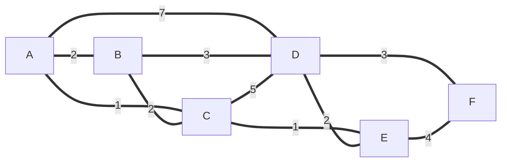

# Dijsktra-SPT
Program that allows you the calculate the Shortest Path Tree for a given node

To run it just clone this repo, compile and hit the run button on your IDE.

I would explain how Dijkstra's algorithm works but if you are reading this I take it you already know it

Test case:

